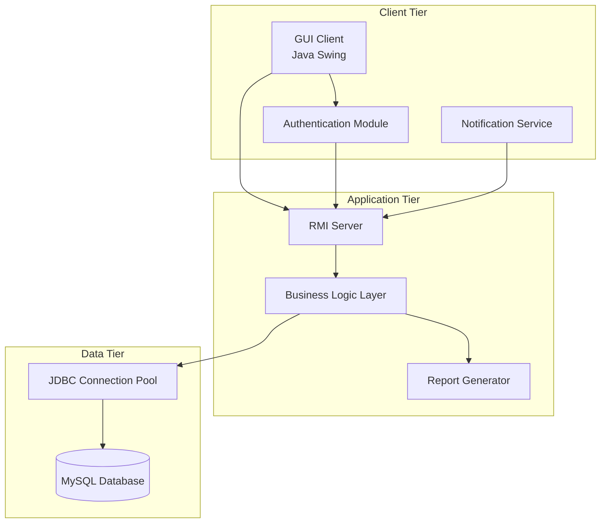
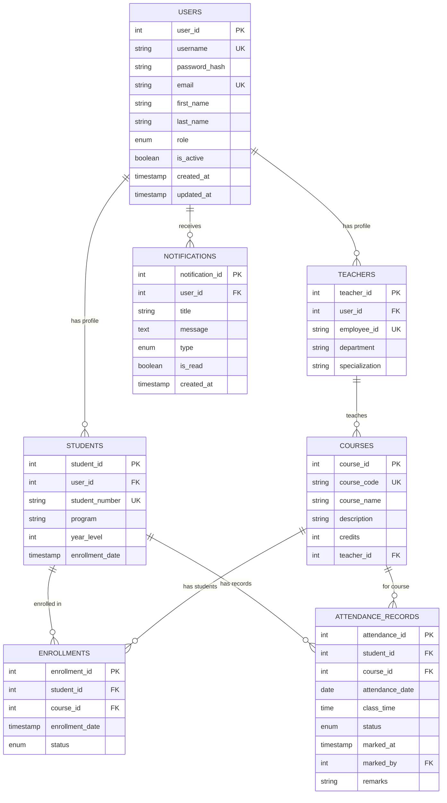

# Design Document

## Overview

The Student Attendance System is a comprehensive desktop application designed to manage student attendance in educational institutions using a client-server architecture. The system employs Java Swing for the graphical user interface, Java RMI (Remote Method Invocation) for distributed communication, and MySQL with JDBC for data persistence. All components are organized within a single Java package to maintain simplicity and ease of deployment.

### System Goals

- **Role-Based Access Control**: Provide secure, role-specific functionality for Admins, Teachers, and Students
- **Real-Time Data Management**: Enable concurrent access to attendance data with immediate updates
- **Scalable Architecture**: Support up to 100 concurrent users with responsive performance
- **Data Integrity**: Ensure consistent and reliable attendance record management
- **User-Friendly Interface**: Deliver intuitive desktop application experience
- **Security**: Implement comprehensive authentication and data protection measures

### Key Design Principles

1. **Single Package Architecture**: All classes reside in `com.attendance.system` package for simplified deployment and maintenance
2. **Separation of Concerns**: Clear distinction between presentation, business logic, and data access layers
3. **Client-Server Model**: RMI-based distributed architecture enabling multiple concurrent clients
4. **Database-Centric Design**: MySQL as the single source of truth for all system data
5. **Security-First Approach**: Authentication, authorization, and data encryption throughout the system

## Architecture

### System Architecture Overview

The Student Attendance System follows a three-tier client-server architecture:



### Package Structure

All components are organized within the single package `com.attendance.system`:

```
com.attendance.system/
├── client/
│   ├── AttendanceGUI.java          # Main GUI application
│   ├── LoginFrame.java             # Authentication interface
│   ├── AdminDashboard.java         # Admin-specific interface
│   ├── TeacherDashboard.java       # Teacher-specific interface
│   ├── StudentDashboard.java       # Student-specific interface
│   └── NotificationPanel.java      # Notification display
├── server/
│   ├── AttendanceServer.java       # RMI server implementation
│   ├── AttendanceServiceImpl.java  # Business logic implementation
│   └── ServerLauncher.java         # Server startup utility
├── model/
│   ├── User.java                   # Base user entity
│   ├── Admin.java                  # Admin entity
│   ├── Teacher.java                # Teacher entity
│   ├── Student.java                # Student entity
│   ├── AttendanceRecord.java       # Attendance record entity
│   ├── Course.java                 # Course entity
│   └── Notification.java           # Notification entity
├── service/
│   ├── AttendanceService.java      # Remote service interface
│   ├── AuthenticationService.java  # Authentication interface
│   ├── ReportService.java          # Report generation interface
│   └── NotificationService.java    # Notification interface
├── dao/
│   ├── DatabaseManager.java        # Database connection management
│   ├── UserDAO.java                # User data access
│   ├── AttendanceDAO.java          # Attendance data access
│   └── CourseDAO.java              # Course data access
├── util/
│   ├── SecurityUtil.java           # Encryption and security utilities
│   ├── DateUtil.java               # Date/time utilities
│   └── ConfigManager.java          # Configuration management
└── exception/
    ├── AuthenticationException.java
    ├── DatabaseException.java
    └── ValidationException.java
```

### Communication Flow

1. **Client Initialization**: GUI client connects to RMI registry and obtains server reference
2. **Authentication**: User credentials are validated through secure RMI calls
3. **Session Management**: Server maintains user sessions with role-based permissions
4. **Data Operations**: All CRUD operations flow through RMI to business logic layer
5. **Database Access**: Business logic interacts with MySQL through JDBC connection pool
6. **Real-time Updates**: Server pushes notifications to connected clients via RMI callbacks

## Components and Interfaces

### Client Components

#### AttendanceGUI (Main Application)
```java
public class AttendanceGUI extends JFrame {
    private AttendanceService remoteService;
    private User currentUser;
    private JPanel currentPanel;
    
    // Main application window management
    public void initializeConnection();
    public void showLoginScreen();
    public void loadUserDashboard(User user);
    public void handleLogout();
}
```

**Responsibilities:**
- Application lifecycle management
- RMI connection establishment
- User session coordination
- Dashboard switching based on user roles

#### Role-Specific Dashboards

**AdminDashboard**
```java
public class AdminDashboard extends JPanel {
    // User management interface
    public void displayUserManagement();
    public void createUserAccount();
    public void modifyUserAccount();
    public void generateSystemReports();
    public void configureSystemSettings();
}
```

**TeacherDashboard**
```java
public class TeacherDashboard extends JPanel {
    // Attendance management interface
    public void displayClassList();
    public void markAttendance();
    public void viewAttendanceHistory();
    public void generateClassReports();
}
```

**StudentDashboard**
```java
public class StudentDashboard extends JPanel {
    // Student attendance viewing interface
    public void displayAttendanceOverview();
    public void viewDetailedHistory();
    public void checkAttendancePercentage();
    public void viewNotifications();
}
```

### Server Components

#### AttendanceServer (RMI Server)
```java
public class AttendanceServer extends UnicastRemoteObject 
                              implements AttendanceService {
    private DatabaseManager dbManager;
    private Map<String, User> activeSessions;
    
    // Core server functionality
    public User authenticateUser(String username, String password);
    public List<AttendanceRecord> getAttendanceRecords(int studentId);
    public boolean markAttendance(AttendanceRecord record);
    public List<User> getAllUsers();
    public boolean createUser(User user);
}
```

**Key Features:**
- Thread-safe session management
- Connection pooling for database access
- Comprehensive error handling and logging
- Security validation for all operations

#### Business Logic Layer
```java
public class AttendanceServiceImpl {
    private UserDAO userDAO;
    private AttendanceDAO attendanceDAO;
    private CourseDAO courseDAO;
    
    // Business rule enforcement
    public boolean validateAttendanceEntry(AttendanceRecord record);
    public double calculateAttendancePercentage(int studentId, int courseId);
    public List<AttendanceRecord> getFilteredRecords(FilterCriteria criteria);
    public boolean enforceBusinessRules(Operation operation);
}
```

### Data Access Layer

#### DatabaseManager
```java
public class DatabaseManager {
    private HikariDataSource connectionPool;
    private static final int MAX_POOL_SIZE = 20;
    private static final int MIN_IDLE = 5;
    
    // Connection management
    public Connection getConnection() throws SQLException;
    public void initializeConnectionPool();
    public void closeConnectionPool();
    public boolean testConnection();
}
```

**Connection Pool Configuration:**
- Maximum connections: 20
- Minimum idle connections: 5
- Connection timeout: 30 seconds
- Idle timeout: 10 minutes
- Maximum lifetime: 30 minutes

#### Data Access Objects (DAOs)

**UserDAO**
```java
public class UserDAO {
    // User management operations
    public User findByCredentials(String username, String password);
    public boolean createUser(User user);
    public boolean updateUser(User user);
    public boolean deleteUser(int userId);
    public List<User> findByRole(UserRole role);
}
```

**AttendanceDAO**
```java
public class AttendanceDAO {
    // Attendance data operations
    public boolean insertAttendanceRecord(AttendanceRecord record);
    public List<AttendanceRecord> findByStudent(int studentId);
    public List<AttendanceRecord> findByDateRange(Date start, Date end);
    public boolean updateAttendanceRecord(AttendanceRecord record);
    public AttendanceStatistics calculateStatistics(int studentId);
}
```

### Service Interfaces

#### AttendanceService (Remote Interface)
```java
public interface AttendanceService extends Remote {
    // Authentication
    User authenticateUser(String username, String password) 
         throws RemoteException, AuthenticationException;
    
    // Attendance operations
    boolean markAttendance(AttendanceRecord record) 
            throws RemoteException, ValidationException;
    List<AttendanceRecord> getAttendanceRecords(int studentId, Date startDate, Date endDate) 
                          throws RemoteException;
    
    // User management (Admin only)
    boolean createUser(User user) throws RemoteException, ValidationException;
    boolean updateUser(User user) throws RemoteException, ValidationException;
    
    // Reporting
    byte[] generateReport(ReportCriteria criteria) 
          throws RemoteException, ReportException;
}
```

## Data Models

### Database Schema



### Entity Classes

#### User (Base Class)
```java
public abstract class User implements Serializable {
    private int userId;
    private String username;
    private String passwordHash;
    private String email;
    private String firstName;
    private String lastName;
    private UserRole role;
    private boolean isActive;
    private LocalDateTime createdAt;
    private LocalDateTime updatedAt;
    
    // Abstract methods for role-specific behavior
    public abstract List<Permission> getPermissions();
    public abstract String getDisplayName();
}
```

#### Student
```java
public class Student extends User {
    private String studentNumber;
    private String program;
    private int yearLevel;
    private LocalDate enrollmentDate;
    private List<Course> enrolledCourses;
    
    // Student-specific methods
    public double getOverallAttendancePercentage();
    public List<AttendanceRecord> getAttendanceHistory();
    public boolean isEligibleForExam(Course course);
}
```

#### Teacher
```java
public class Teacher extends User {
    private String employeeId;
    private String department;
    private String specialization;
    private List<Course> assignedCourses;
    
    // Teacher-specific methods
    public List<Student> getStudentsInCourse(Course course);
    public boolean canMarkAttendance(Course course);
    public List<AttendanceRecord> getClassAttendance(Course course, LocalDate date);
}
```

#### AttendanceRecord
```java
public class AttendanceRecord implements Serializable {
    private int attendanceId;
    private int studentId;
    private int courseId;
    private LocalDate attendanceDate;
    private LocalTime classTime;
    private AttendanceStatus status; // PRESENT, ABSENT, LATE, EXCUSED
    private LocalDateTime markedAt;
    private int markedBy;
    private String remarks;
    
    // Validation methods
    public boolean isValidForDate(LocalDate date);
    public boolean canBeModified();
    public String getStatusDisplay();
}
```

### Enumerations

```java
public enum UserRole {
    ADMIN("Administrator"),
    TEACHER("Teacher"),
    STUDENT("Student");
    
    private final String displayName;
}

public enum AttendanceStatus {
    PRESENT("Present"),
    ABSENT("Absent"),
    LATE("Late"),
    EXCUSED("Excused");
    
    private final String displayName;
}

public enum NotificationType {
    ATTENDANCE_WARNING("Attendance Warning"),
    SYSTEM_NOTIFICATION("System Notification"),
    COURSE_UPDATE("Course Update");
    
    private final String displayName;
}
```
## Correctness Properties

*A property is a characteristic or behavior that should hold true across all valid executions of a system-essentially, a formal statement about what the system should do. Properties serve as the bridge between human-readable specifications and machine-verifiable correctness guarantees.*

Based on the prework analysis, the following properties have been identified as suitable for property-based testing. After reflection to eliminate redundancy, these properties provide comprehensive validation coverage:

### Property 1: Authentication Success with Valid Credentials

*For any* valid user credentials (username, password, role combination), the Authentication_Module should successfully authenticate the user and return a User object with the correct role and permissions.

**Validates: Requirements 1.1**

### Property 2: Authentication Failure with Invalid Credentials

*For any* invalid user credentials (wrong passwords, non-existent users, malformed inputs), the Authentication_Module should deny access and throw an AuthenticationException with an appropriate error message.

**Validates: Requirements 1.2**

### Property 3: Role-Based Access Control Enforcement

*For any* authenticated user, the system should only allow access to functionality that matches their assigned role permissions, denying access to operations outside their role scope.

**Validates: Requirements 1.3**

### Property 4: Password Encryption and Verification

*For any* password string, the Authentication_Module should hash it using a secure algorithm such that: (1) the same password produces different hashes when salted, (2) the original password can be verified against its hash, and (3) the hash cannot be easily reversed.

**Validates: Requirements 1.5**

### Property 5: User Account Creation with Valid Data

*For any* valid user profile data (name, email, role, credentials), the Admin should be able to create a new user account that can be successfully retrieved and authenticated.

**Validates: Requirements 2.1**

### Property 6: User Account Modification Preserves Data Integrity

*For any* existing user account and valid modification data, updating the account should preserve data integrity such that all unchanged fields remain the same and all changed fields reflect the new values.

**Validates: Requirements 2.2**

### Property 7: Email Uniqueness Validation

*For any* email address, the system should enforce uniqueness such that attempting to create or update a user account with an already-existing email address should fail with a validation error.

**Validates: Requirements 2.4**

### Property 8: Audit Logging Completeness

*For any* account management operation (create, update, delete, password reset), the system should create an audit log entry containing the operation type, timestamp, performing user, and affected account details.

**Validates: Requirements 2.6**

### Property 9: Student List Retrieval Accuracy

*For any* valid class and date combination, the system should return exactly the list of students enrolled in that class, with no duplicates and no students from other classes.

**Validates: Requirements 3.1**

### Property 10: Attendance Record Creation and Storage

*For any* valid attendance marking operation (student, course, date, status), the system should create an AttendanceRecord with accurate timestamp and store it such that it can be retrieved with all original data intact.

**Validates: Requirements 3.2, 3.3**

### Property 11: Attendance Modification Time Window Enforcement

*For any* attendance record, modification attempts should succeed only if made within 24 hours of the original entry timestamp, and fail with appropriate error messages otherwise.

**Validates: Requirements 3.4**

### Property 12: Future Date Validation for Attendance

*For any* attendance marking attempt, the system should reject entries with future dates and accept only current or past dates within reasonable bounds.

**Validates: Requirements 3.5**

### Property 13: Duplicate Attendance Prevention

*For any* student, course, and date combination, the system should allow only one attendance record and prevent duplicate entries while preserving the ability to modify the existing record.

**Validates: Requirements 3.6**

### Property 14: Attendance Filtering Accuracy

*For any* combination of filter criteria (date range, subject, attendance status), the system should return exactly those attendance records that match all specified criteria, with no false positives or negatives.

**Validates: Requirements 4.2**

### Property 15: Attendance Percentage Calculation Correctness

*For any* set of attendance records for a student and course, the calculated attendance percentage should equal (present + late records) / total records * 100, rounded to appropriate precision.

**Validates: Requirements 4.3**

### Property 16: Low Attendance Notification Triggering

*For any* student whose attendance percentage falls below 75% in any subject, the Notification_Service should generate and deliver a warning notification within the specified time frame.

**Validates: Requirements 4.5, 10.1**

### Property 17: Database Entity Storage and Retrieval Round-Trip

*For any* valid entity (Student, Teacher, AttendanceRecord, Admin), storing the entity in the database and then retrieving it should return an equivalent entity with all field values preserved.

**Validates: Requirements 5.1**

### Property 18: Transaction Atomicity and Consistency

*For any* multi-operation database transaction, either all operations should succeed and be committed, or all operations should fail and be rolled back, maintaining database consistency.

**Validates: Requirements 5.3**

### Property 19: Database Error Handling and Logging

*For any* database operation that encounters an error, the system should log the error with sufficient detail and provide a meaningful error message to the user without exposing sensitive system information.

**Validates: Requirements 5.4**

### Property 20: Referential Integrity Enforcement

*For any* database operation that would violate referential integrity constraints (e.g., creating attendance record for non-existent student), the system should reject the operation and maintain data consistency.

**Validates: Requirements 5.6**

### Property 21: RMI Request Validation and Security

*For any* incoming RMI request, the server should validate the request for security and data integrity, rejecting malformed or malicious requests while processing valid ones correctly.

**Validates: Requirements 6.5**

### Property 22: Data Transmission Encryption

*For any* data transmitted between client and server, the system should apply encryption such that the transmitted data cannot be read in plain text by network interceptors.

**Validates: Requirements 6.6**

### Property 23: Report Generation with Filtering

*For any* combination of report filter criteria (date range, class, student, teacher), the Report_Generator should produce a report containing exactly the data that matches the specified criteria.

**Validates: Requirements 7.1**

### Property 24: Report Export Format Integrity

*For any* generated report, exporting to PDF and Excel formats should preserve all data and formatting such that the exported files contain the same information as the original report.

**Validates: Requirements 7.4**

### Property 25: Report Content Completeness

*For any* generated attendance report, the output should include attendance percentages, trends, and summary statistics as required, with mathematically correct calculations.

**Validates: Requirements 7.6**

### Property 26: Role-Specific Dashboard Display

*For any* authenticated user, the GUI should display a dashboard and navigation menu that corresponds exactly to their role permissions, showing appropriate functionality and hiding restricted features.

**Validates: Requirements 8.1**

### Property 27: Form Validation and Error Highlighting

*For any* form submission with invalid data, the GUI should validate the input, prevent submission, and highlight specific errors before any data is sent to the server.

**Validates: Requirements 8.3**

### Property 28: Progress Indicator Display Logic

*For any* operation with duration greater than 1 second, the GUI should display a progress indicator, and for operations completing in less than 1 second, no progress indicator should appear.

**Validates: Requirements 8.6**

### Property 29: System Overload Graceful Handling

*For any* system load condition that exceeds capacity, the system should handle requests gracefully by providing appropriate user feedback rather than crashing or becoming unresponsive.

**Validates: Requirements 9.3**

### Property 30: Automatic Recovery from Temporary Failures

*For any* temporary system failure (network interruption, database timeout), the system should automatically recover without data loss and restore normal operation.

**Validates: Requirements 9.6**

### Property 31: Time-Based Notification Delivery

*For any* attendance marked as absent, the Notification_Service should deliver a notification to the affected student within the specified 1-hour time limit.

**Validates: Requirements 10.3**

### Property 32: Notification Preference Application

*For any* student's notification preference configuration (email, in-app, frequency), the system should respect these preferences when delivering notifications.

**Validates: Requirements 10.4**

### Property 33: Teacher Attendance Reminder Logic

*For any* class session where attendance has not been marked within 2 hours of the class end time, the system should send a reminder notification to the assigned teacher.

**Validates: Requirements 10.5**

### Property 34: Sensitive Data Encryption Storage

*For any* sensitive data stored in the database, the system should encrypt it using AES-256 encryption such that the stored data cannot be read without proper decryption.

**Validates: Requirements 11.1**

### Property 35: Password Policy Enforcement

*For any* password input, the system should enforce the security policy requiring minimum 8 characters with mixed case, numbers, and symbols, rejecting non-compliant passwords.

**Validates: Requirements 11.2**

### Property 36: Comprehensive Activity Audit Logging

*For any* user activity in the system, an audit log entry should be created with sufficient detail for security monitoring and compliance tracking.

**Validates: Requirements 11.3**

### Property 37: Unauthorized Access Response

*For any* detected unauthorized access attempt, the system should lock the affected account and send notification to administrators within the specified time frame.

**Validates: Requirements 11.4**

### Property 38: Role-Based Database Access Control

*For any* database access attempt, the system should enforce role-based access controls such that users can only access data appropriate to their role permissions.

**Validates: Requirements 11.6**

### Property 39: System Configuration Parameter Application

*For any* system configuration change made by an Admin (session timeout, backup schedules, notification settings), the new parameters should be applied correctly and take effect immediately.

**Validates: Requirements 12.1**

### Property 40: Database Maintenance Operation Correctness

*For any* database maintenance operation (cleanup, optimization), the operation should complete successfully while preserving data integrity and improving system performance.

**Validates: Requirements 12.2**

### Property 41: System Health Monitoring and Alerting

*For any* critical system health issue, the monitoring system should detect the condition and generate appropriate alerts to administrators within the specified time frame.

**Validates: Requirements 12.3**

### Property 42: Maintenance Mode User Notification

*For any* scheduled system maintenance period, the system should activate maintenance mode and notify all users with appropriate messages about the maintenance window and expected duration.

**Validates: Requirements 12.5**

### Property 43: Comprehensive System Operation Logging

*For any* system operation, appropriate log entries should be created with sufficient detail for troubleshooting and performance monitoring purposes.

**Validates: Requirements 12.6**

## Error Handling

### Exception Hierarchy

The system implements a comprehensive exception handling strategy with custom exceptions:

```java
// Base exception for all system errors
public class AttendanceSystemException extends Exception {
    private final ErrorCode errorCode;
    private final String userMessage;
    private final String technicalDetails;
}

// Authentication-related errors
public class AuthenticationException extends AttendanceSystemException {
    public AuthenticationException(String message, ErrorCode code);
}

// Database operation errors
public class DatabaseException extends AttendanceSystemException {
    public DatabaseException(String message, Throwable cause, ErrorCode code);
}

// Input validation errors
public class ValidationException extends AttendanceSystemException {
    private final List<ValidationError> validationErrors;
}

// RMI communication errors
public class RemoteServiceException extends AttendanceSystemException {
    public RemoteServiceException(String message, Throwable cause);
}
```

### Error Handling Strategies

#### Client-Side Error Handling
- **Network Failures**: Automatic retry with exponential backoff, connection status display
- **Validation Errors**: Real-time form validation with field-specific error highlighting
- **User Errors**: Clear, actionable error messages with suggested corrections
- **Session Expiry**: Automatic logout with session restoration options

#### Server-Side Error Handling
- **Database Errors**: Transaction rollback, connection pool recovery, detailed logging
- **Business Logic Violations**: Validation with specific error codes and messages
- **Resource Exhaustion**: Graceful degradation with appropriate user feedback
- **Security Violations**: Account locking, administrator alerts, audit logging

#### Error Recovery Mechanisms
- **Automatic Retry**: For transient network and database errors
- **Circuit Breaker**: For external service dependencies
- **Fallback Operations**: Alternative workflows when primary operations fail
- **Data Consistency**: Transaction management and rollback procedures

### Logging Strategy

```java
public class SystemLogger {
    // Different log levels for different types of events
    public void logUserActivity(User user, String action, String details);
    public void logSecurityEvent(String event, String details, SecurityLevel level);
    public void logSystemError(Exception error, String context);
    public void logPerformanceMetric(String operation, long duration);
    public void logDatabaseOperation(String query, long executionTime);
}
```

## Testing Strategy

### Dual Testing Approach

The Student Attendance System employs a comprehensive testing strategy combining unit tests and property-based tests:

#### Unit Testing
- **Specific Examples**: Test concrete scenarios with known inputs and expected outputs
- **Edge Cases**: Boundary conditions, null values, empty collections, maximum limits
- **Integration Points**: Component interactions, database connections, RMI communication
- **Error Conditions**: Exception handling, validation failures, network timeouts

#### Property-Based Testing
- **Universal Properties**: Test behaviors that should hold across all valid inputs
- **Comprehensive Coverage**: Generate thousands of test cases automatically
- **Edge Case Discovery**: Find unexpected failure modes through randomization
- **Regression Prevention**: Ensure properties continue to hold as code evolves

### Property-Based Testing Configuration

**Testing Framework**: QuickCheck for Java (or similar property-based testing library)
**Test Execution**: Minimum 100 iterations per property test
**Test Tagging**: Each property test references its design document property

Example property test structure:
```java
@Property
@Tag("Feature: student-attendance-system, Property 15: Attendance Percentage Calculation Correctness")
public void attendancePercentageCalculationIsCorrect(
    @ForAll List<AttendanceRecord> records) {
    
    // Test implementation
    double calculatedPercentage = attendanceService.calculatePercentage(records);
    double expectedPercentage = calculateExpectedPercentage(records);
    
    assertThat(calculatedPercentage).isCloseTo(expectedPercentage, within(0.01));
}
```

### Test Categories

#### Authentication and Security Tests
- Password hashing and verification properties
- Role-based access control validation
- Session management and timeout handling
- Audit logging completeness verification

#### Data Management Tests
- Database CRUD operation properties
- Transaction atomicity and consistency
- Referential integrity enforcement
- Data encryption and decryption round-trips

#### Business Logic Tests
- Attendance calculation accuracy
- Notification triggering conditions
- Report generation and filtering
- Validation rule enforcement

#### User Interface Tests
- Role-specific dashboard display
- Form validation and error handling
- Progress indicator behavior
- Navigation and accessibility features

#### System Integration Tests
- RMI communication reliability
- Database connection pooling
- Error recovery mechanisms
- Performance under load conditions

### Test Data Management

#### Test Database
- Separate test database instance
- Automated schema creation and cleanup
- Test data generation utilities
- Transaction isolation for parallel tests

#### Mock Services
- RMI service mocks for unit testing
- Database connection mocks for isolation
- External service simulators
- Network failure simulation

### Continuous Testing

#### Automated Test Execution
- Pre-commit hooks for critical tests
- Continuous integration pipeline
- Nightly full test suite execution
- Performance regression detection

#### Test Metrics and Reporting
- Code coverage analysis
- Property test failure analysis
- Performance benchmark tracking
- Test execution time monitoring